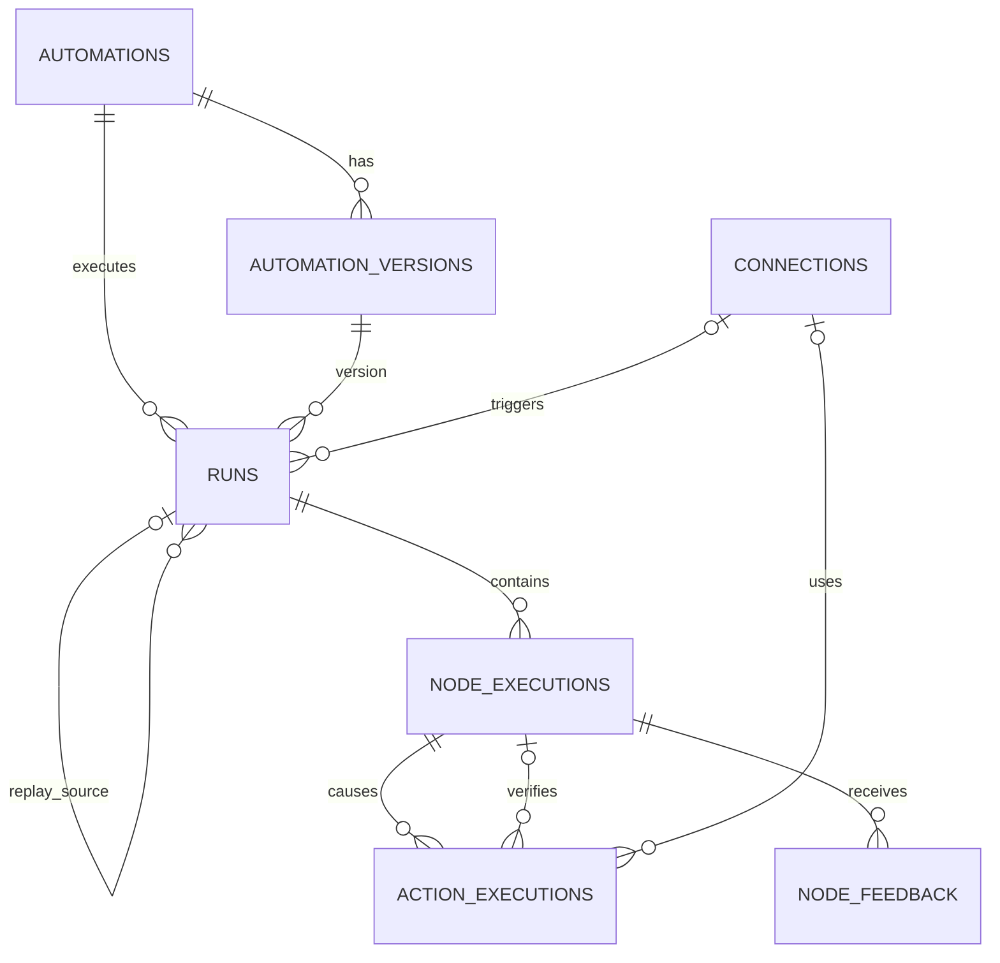

# Database Domain Audit

Status: validation of `docs/database-domain.md`. No Drizzle schema/migration changes are made by this audit.

## 1. Market references reviewed

### n8n

Relevant patterns:

- workflow identity and historical versions are separate concerns
- the active workflow points at an `activeVersionId`
- graph nodes/connections are stored as JSON rather than fully normalized graph tables
- executions retain both workflow identity and workflow-version identity
- execution rows have a deduplication key
- execution retry lineage exists
- execution annotations are a separate table rather than rewriting execution evidence

Implication for Atlas:

- Automation + AutomationVersion is a sound split.
- JSONB graph snapshots are not an unusual shortcut.
- `active_version_id` is clearer than `current_version_id`.
- idempotency and feedback deserve first-class persistence seams.

### LangGraph

Relevant patterns:

- `Run` is the execution-level term
- checkpoint state is persisted separately from node/task writes
- node/task writes can be retained independently so completed work does not need to be rerun after failure
- threads/checkpoints are introduced for durable stateful execution, not just observability

Implication:

- `Run` is good terminology.
- Our initial NodeExecution evidence is enough for short DAG-like Email Triage, but it is **not** a full durable-execution/checkpoint model.
- Checkpoints/event history should remain deferred until graphs need interrupt/resume, long waits, parallel recovery, or agent loops.

### Trigger.dev

Relevant patterns:

- `TaskRun` and `TaskRunAttempt` are distinct runtime concepts
- idempotency is first-class
- replay is a first-class operation
- attempts/retries are operational evidence, not only a final task status

Implication:

- our run idempotency is directionally correct
- retry attempts are a real future seam
- current NodeExecution must not be designed so that retries can only overwrite old evidence

### Temporal

Relevant patterns:

- `Workflow Execution` represents composite orchestration
- `Activity` represents a single operation on the external world
- replay must not execute external I/O again; previous Activity results are taken from history
- retries can create multiple Activity Task executions
- child workflows are a first-class hierarchy
- `SideEffect` has a specific Temporal meaning related to deterministic workflow replay

Implication:

- replay being side-effect-free is mandatory
- external action idempotency matters independently from trigger idempotency
- the table name `side_effects` is more ambiguous than necessary in workflow-engine terminology
- child Automation execution should have a clear future representation

### Langfuse

Relevant patterns:

- a trace contains observations/spans/generations rather than flattening all model metrics onto the top-level trace
- model calls retain model parameters, input/output, usage details, cost details, and metadata
- usage/cost are maps because modern providers have more buckets than only input/output tokens
- evaluation scores/annotations are separate records attached to traces/observations

Implication:

- model evidence belongs on NodeExecution
- `input_tokens/output_tokens` alone are too narrow for a product whose core goal includes model cost/quality optimization
- a minimal feedback record is not premature; it is required to eventually measure correctness rather than only disagreement

### Prefect / Hatchet

Relevant patterns:

- flow/workflow runs and task runs are distinct layers
- task identities are stable across executions
- retries/run counts are modeled
- subflows/child runs have parent relationships

Implication:

- stable `node_key` is a good concept
- future node retries and child Automation runs need explicit seams

---

## 2. Terminology audit

| Current term | Verdict | Recommendation |
| --- | --- | --- |
| Automation | keep | Product language is natural even though many engines say Workflow |
| AutomationVersion | keep | Clear and matches immutable version semantics |
| `current_version_id` | change | Rename to `active_version_id` |
| Run | keep | Very conventional |
| NodeExecution | keep | Clear for a graph-node execution; avoids overloading Run |
| Connection | keep | Natural external-system instance |
| `side_effects` | change | Rename to `action_executions` |
| `source_snapshot` | consider change | `trigger_snapshot` is more precise for live-source evidence |
| `ordinal` | change | `sequence` is clearer as monotonic execution ordering |

### Why `side_effects -> action_executions`?

`SideEffect` is valid generic software terminology, but workflow systems—especially Temporal—use it for a different deterministic-replay concept.

Our row means:

> one concrete external operation attempted by an action node, together with execution and verification evidence.

`action_executions` says that directly.

NodeExecution(kind=action) records the graph-node execution.
ActionExecution records the external operation(s) that node caused.

---

## 3. Use-case validation

Legend:

- PASS — current design is sufficient
- AMBIGUOUS — representable, but semantics need clarification
- GAP — current ERD cannot reliably satisfy the use case

### UC-1: Gmail message -> classify -> no_action

Result: **PASS**

Needed records:

- Run
- trigger/input snapshots
- classifier NodeExecution
- selected edge
- terminal NodeExecution

No ActionExecution is necessary.

### UC-2: Gmail message -> classify -> archive -> verify archive

Result: **AMBIGUOUS**

The design can store:

- action NodeExecution
- verification NodeExecution
- SideEffect verification fields

But it does not explicitly link the verifier node to the external effect it verified.

Recommendation:

Add `verified_by_node_execution_id` nullable FK on ActionExecution.

That makes the explicit graph node and the verification lifecycle one coherent model rather than two disconnected sources of evidence.

### UC-3: Telegram API succeeds but delivery cannot be verified

Result: **PASS**

This is one of the strongest parts of the design:

```text
run.status                  = succeeded
action.execution_status     = succeeded
action.verification_status  = unverified
```

UI attention can be derived correctly.

### UC-4: Duplicate Gmail trigger is delivered twice

Result: **PASS**

The live Run idempotency key handles duplicate source events.

Keep the partial unique constraint scoped by Automation.

### UC-5: Process crashes after Telegram send, before the success record is finalized

Result: **GAP — important**

Run-level idempotency does not solve this.

If the worker restarts and retries the action node, the same notification may be sent twice.

Recommendation:

ActionExecution needs its own deterministic `idempotency_key`.

Execution pattern:

1. derive deterministic action idempotency key
2. create/claim ActionExecution before external I/O
3. invoke provider
4. persist response/evidence
5. verify

Recommended uniqueness:

```text
UNIQUE (connection_id, idempotency_key)
WHERE idempotency_key IS NOT NULL
```

If the provider supports native idempotency, pass the same key downstream as well.

### UC-6: LLM provider returns 429, executor retries classify_email

Result: **AMBIGUOUS / future GAP**

Current NodeExecution can only represent a final execution cleanly.

Market workflow engines distinguish task/activity attempts.

Do **not** add a NodeAttempt table yet, but define the seam:

- NodeExecution history must never be overwritten to hide a failed attempt.
- when executor retries are implemented, either:
  - add `node_attempts`, or
  - explicitly redefine NodeExecution as a physical attempt and add invocation identity.

Do not lock the schema into “one node key = one row per run”.

### UC-7: Compare Jev vs another model on old emails

Result: **PARTIAL PASS**

Replay lineage and immutable inputs work well.

It can compare:

- route disagreement
- latency
- usage
- cost

But it cannot determine which model is **more correct** without ground truth.

This is a core product requirement, not optional analytics.

Recommendation:

Add minimal `node_feedback`:

```text
id
node_execution_id
verdict              correct | incorrect
expected_output      jsonb nullable
note                 text nullable
created_at
```

The original execution remains immutable.

A replay of `classify_email` can compare its output with feedback attached to the source run's `classify_email`.

This is deliberately much smaller than an evaluation platform.

### UC-8: Optimize modern reasoning/caching models

Result: **GAP**

`input_tokens` + `output_tokens` are not enough for modern provider usage.

Relevant possible usage buckets include:

- uncached input
- cached input
- cache write
- output
- reasoning
- audio or provider-specific units

Recommendation:

On NodeExecution, replace the rigid token pair with:

```text
model_provider
model
model_parameters    jsonb nullable
provider_request_id text nullable
usage_details       jsonb nullable
cost_details        jsonb nullable
cost_usd            numeric nullable
duration_ms
```

`cost_usd` stays as a convenient normalized total.

The JSON detail maps preserve provider-specific evidence without adding columns for every new billing unit.

### UC-9: Gmail source connection itself must be identifiable

Result: **GAP**

Connections are currently attached only to external effects.

A Run triggered by Gmail should retain which configured Gmail account produced it without requiring JSON inspection.

Recommendation:

Add nullable `trigger_connection_id` FK to Runs.

It is null for manual/test/replay runs when no external connection directly triggered the run.

### UC-10: Email Triage routes into Purchase Extraction or Auto Reply as a separate Automation

Result: **GAP for explicit hierarchy**

This is already a stated future product direction.

Recommendation:

Add nullable `parent_run_id` self-FK to Runs.

A child Automation gets a new Run and points to its parent Run.

Do not add child-run tables.

The invoking parent's NodeExecution can store the child Run ID in its output snapshot, while `parent_run_id` provides efficient hierarchy traversal.

This is analogous to subflow / child workflow relationships in mature workflow engines.

### UC-11: Replay an old Run

Result: **PASS with one invariant**

`replay_of_run_id` is useful.

Required invariant:

Replay is side-effect-free by default.

External action nodes must be skipped/simulated unless an explicit future mode intentionally opts into real effects.

### UC-12: Archive/delete an Automation or Connection after months of history

Result: **AMBIGUOUS**

Hard deletes risk destroying or invalidating evidence.

Recommendation:

- Automation status: `active | paused | archived`
- Connection status: retain `disabled`/archived semantics
- historical Run/Version/Action FK paths use RESTRICT or SET NULL only where historical meaning is still independently captured
- do not cascade-delete execution history

n8n explicitly has workflow archival, and run-oriented systems have learned that destructive cascades over historical execution references are risky.

### UC-13: Email contains large attachments

Result: **PASS only for MVP text, not arbitrary blobs**

Do not place attachment binary data in JSONB.

Store:

- message text / structured metadata in snapshots
- attachment metadata/reference

Introduce blob storage only when real attachment processing is implemented.

No schema table is needed yet.

### UC-14: Worker crashes midway and must resume a complex long-running/parallel graph

Result: **DEFERRED GAP**

NodeExecution records are observability/evidence, but they are not a full durable checkpoint/event-history engine.

For the initial Email Triage DAG, transaction boundaries plus idempotent actions are enough.

When the product adds:

- long waits
- human interrupts
- parallel nodes with partial completion
- loops/agents
- resume-after-deploy semantics

then add checkpoint/event-history semantics or adopt a durable execution runtime.

Do not implement LangGraph/Temporal-style checkpointing preemptively.

---

## 4. Recommended ERD revision

The original six entities are directionally correct, but the validated MVP persistence shape should become **seven entities**:

```text
Automation
AutomationVersion
Connection
Run
NodeExecution
ActionExecution
NodeFeedback
```

### Revised relationships



### Revised important fields

#### Automation

```text
active_version_id   # rename from current_version_id
status              # active | paused | archived
```

#### Run

Add:

```text
trigger_connection_id
parent_run_id
```

Keep:

```text
automation_id
automation_version_id
mode
idempotency_key
replay_of_run_id
trigger_snapshot
input_snapshot
output_snapshot
```

#### NodeExecution

Rename:

```text
ordinal -> sequence
```

Model evidence:

```text
model_provider
model
model_parameters
provider_request_id
usage_details
cost_details
cost_usd
duration_ms
```

Remove rigid `input_tokens`/`output_tokens` from the persistence contract.

#### ActionExecution

Rename from SideEffect.

Add:

```text
idempotency_key
verified_by_node_execution_id
```

Keep separate:

```text
execution_status
verification_status
```

#### NodeFeedback

Minimal correctness evidence:

```text
id
node_execution_id
verdict
expected_output
note
created_at
```

No score configs, evaluation datasets, annotation queues, reviewers, or experiments yet.

---

## 5. Database constraints to strengthen

### Run -> version consistency

Keeping both `automation_id` and `automation_version_id` is useful for common queries and idempotency scope, but consistency must not be accidental.

Prefer a composite FK shape or equivalent DB constraint so the referenced version belongs to the same Automation.

### Active version consistency

`automations.active_version_id` must point to a version belonging to that same Automation.

This may require a composite FK or initially an application invariant depending on Drizzle migration ergonomics.

### Action -> node consistency

An ActionExecution belongs to the Run implied by its NodeExecution. Avoid a redundant `run_id` on ActionExecution unless a measured query need justifies denormalization.

### Verification link

If `verified_by_node_execution_id` is present, verifier and action should belong to the same Run.

Initially enforce in application code if a composite/self-referential DB constraint becomes disproportionately complex.

### Deletion policy

Execution history is evidence:

- no cascade from Automation/Version/Connection into historical Runs/NodeExecutions/ActionExecutions
- prefer archive/disable over delete
- feedback is append-only evidence

---

## 6. What should still remain deferred

After this audit, these are still clearly premature:

- normalized graph node/edge tables
- model registry
- prompt registry
- generic evaluation framework
- checkpoint/event-history tables
- queue tables
- generic artifact system
- user/RBAC/multi-tenant scope
- generic polymorphic annotations
- JSONB GIN indexes
- partitioning

---

## 7. Final assessment

### Strong parts of the original design

- Automation / immutable AutomationVersion split
- graph snapshot as JSONB
- Run bound to exact version
- NodeExecution as per-node evidence
- separate external execution vs verification status
- run-level idempotency
- replay lineage
- immutable historical evidence
- read models not duplicated as persistence source of truth

### Material changes recommended before Drizzle implementation

1. `current_version_id -> active_version_id`
2. `side_effects -> action_executions`
3. `source_snapshot -> trigger_snapshot`
4. `ordinal -> sequence`
5. add `runs.trigger_connection_id`
6. add `runs.parent_run_id`
7. add `action_executions.idempotency_key`
8. add `action_executions.verified_by_node_execution_id`
9. make LLM usage/cost evidence extensible JSON maps
10. add minimal `node_feedback` for correctness ground truth
11. add archive/no-hard-delete semantics
12. preserve a future retry/attempt seam without implementing attempt tables yet

With these changes, the ERD still remains small but covers the actual product requirements more faithfully.
