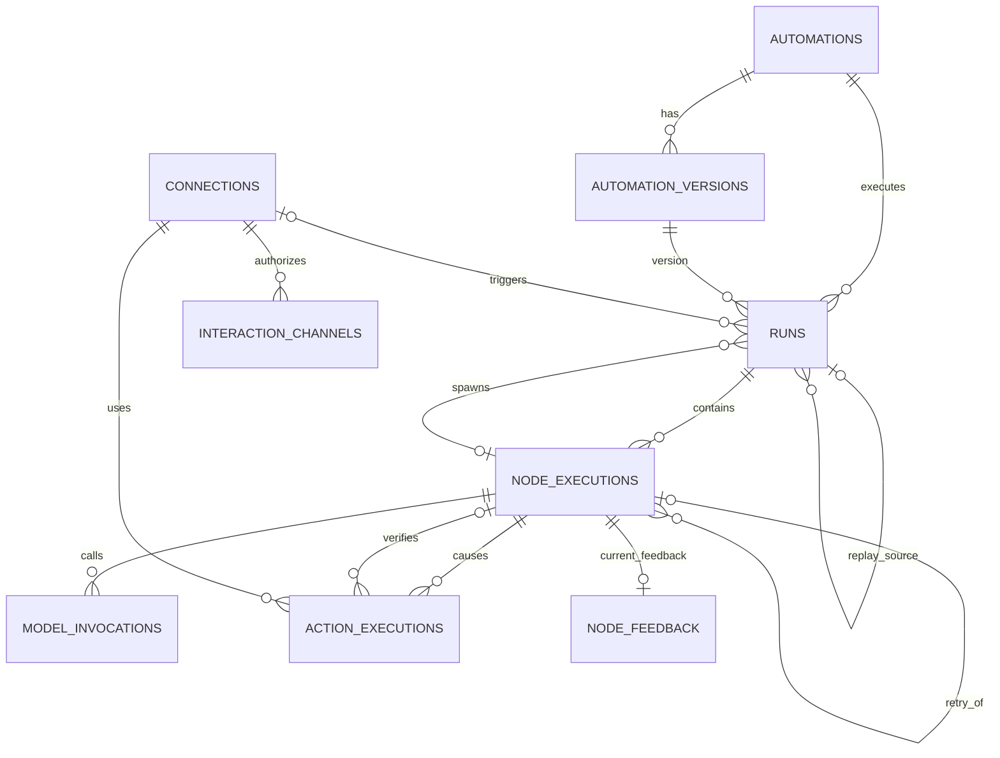

# Database Domain & ERD — v4

Status: **canonical v4 design, implemented and database-verified**.

This document supersedes the original v1/v2 proposal. It incorporates:

- market-reference audit
- concrete row-set simulation
- failure/replay/feedback/child-automation cases

Implemented by `packages/db/src/schema.ts`, `packages/db/drizzle/0000_initial_control_plane.sql`, and `packages/db/drizzle/0001_integration_identity.sql`. Fresh-schema, legacy-backfill, and constraint probes have been verified against PostgreSQL.

The later [message-admission change](message-admission-decision.md) adds migration 0002 and a partial unique index for non-null test-event keys. The nine entities and ERD relationships are unchanged. Existing live-event uniqueness and null-key manual tests are preserved.

Related validation material:

- `docs/database-domain-audit.md`
- `docs/database-row-simulation-audit.md`
- `docs/fixtures/database-v2-rowsets.json`

---

## 1. Design principles

1. **Automation behavior is versioned and immutable.**
2. **Execution history is evidence.**
3. **Graph definition and execution evidence are different persistence concerns.**
4. **Run success and external-effect verification are different facts.**
5. **A NodeExecution is not the same thing as a model invocation.**
6. **Retries must never overwrite failed historical attempts.**
7. **Replay is side-effect-free by default.**
8. **Human feedback does not rewrite execution history.**
9. **UI aggregates are derived read models, not authoritative columns.**
10. **Do not build a durable workflow engine before the product requires one.**

---

## 2. Final first-slice entities

```text
Automation
AutomationVersion
Connection
InteractionChannel

Run
NodeExecution
ModelInvocation
ActionExecution
NodeFeedback
```

These nine entities are the canonical persistence model after the integration-identity migration.

---

## 3. Canonical ERD



---

# 4. Cross-cutting SQL conventions

## IDs

Primary IDs are PostgreSQL `uuid`.

The implementation may use Drizzle `defaultRandom()` / PostgreSQL random UUID generation.

IDs have no domain meaning.

## Timestamps

All persisted timestamps use:

```text
timestamptz
```

Application code treats them as instants. Local timezone is a presentation concern.

## Status fields

Use:

```text
text + CHECK
```

rather than PostgreSQL ENUM types.

Reason:

- values remain DB validated
- adding a state does not require enum-type migration choreography
- the set remains explicit in migrations/domain schemas

## JSONB

JSONB is used for variable-shaped configuration/evidence, not as a substitute for relational identity.

Relational columns are used for:

- identity
- relationships
- statuses
- modes
- stable keys
- timestamps
- normalized total cost
- fields used for known filtering/indexing

## Money/cost

Normalized model cost:

```text
numeric(20,12)
```

No floating-point type.

Provider-specific cost details remain JSONB.

## Delete policy

Historical execution evidence is preserved.

Default FK deletion policy for historical references:

```text
ON DELETE RESTRICT
```

No execution-history table participates in cascade deletion.

Operational entities are archived/disabled instead of routinely hard-deleted.

---

# 5. `automations`

Long-lived identity of one automation.

Examples:

- `email-triage`
- `purchase-extraction`

## Columns

| column              | type        | null | rule                       |
| ------------------- | ----------- | ---- | -------------------------- |
| `id`                | uuid        | no   | PK                         |
| `key`               | text        | no   | stable machine key         |
| `name`              | text        | no   | display name               |
| `description`       | text        | yes  |                            |
| `status`            | text        | no   | active / paused / archived |
| `active_version_id` | uuid        | yes  | active live version        |
| `created_at`        | timestamptz | no   | default now                |
| `updated_at`        | timestamptz | no   | application maintained     |

## PK

```text
PRIMARY KEY (id)
```

## UNIQUE

```text
UNIQUE (key)
```

## CHECK

```text
status IN ('active', 'paused', 'archived')
length(trim(key)) > 0
length(trim(name)) > 0
```

## FK

The active version must belong to the same Automation.

Use the composite relationship:

```text
FOREIGN KEY (id, active_version_id)
  REFERENCES automation_versions(automation_id, id)
  ON DELETE RESTRICT
```

`active_version_id` is nullable so the Automation can be inserted before its first version exists.

## Mutability

Mutable:

- name
- description
- status
- active_version_id
- updated_at

Stable after creation:

- id
- key

Changing the conceptual identity means creating another Automation.

---

# 6. `automation_versions`

Immutable behavior snapshot.

The complete graph definition belongs here.

## Columns

| column                      | type        | null | rule                                     |
| --------------------------- | ----------- | ---- | ---------------------------------------- |
| `id`                        | uuid        | no   | PK                                       |
| `automation_id`             | uuid        | no   | owner                                    |
| `version_number`            | integer     | no   | monotonically assigned within Automation |
| `definition_schema_version` | integer     | no   | serialized graph contract version        |
| `graph_definition`          | jsonb       | no   | immutable graph                          |
| `definition_hash`           | text        | no   | deterministic behavior-definition hash   |
| `source_revision`           | text        | yes  | git/source provenance                    |
| `created_at`                | timestamptz | no   | default now                              |

## PK

```text
PRIMARY KEY (id)
```

## UNIQUE

```text
UNIQUE (automation_id, version_number)

-- supports composite FKs that must prove ownership
UNIQUE (automation_id, id)
```

## CHECK

```text
version_number > 0
definition_schema_version > 0
jsonb_typeof(graph_definition) = 'object'
length(trim(definition_hash)) > 0
```

## FK

```text
automation_id
  REFERENCES automations(id)
  ON DELETE RESTRICT
```

## Immutability

After creation, behavior-defining fields are never updated.

Any change to:

- graph topology
- route set
- node config
- prompt/model configuration
- connection reference
- action behavior

creates another AutomationVersion.

No database trigger is required initially. Repository/application code exposes no update operation for version definitions.

## Why JSONB?

The graph is an immutable configuration artifact.

Node-level runtime querying is handled by NodeExecution / ModelInvocation / ActionExecution.

Do **not** normalize graph nodes/edges into tables in this slice.

---

# 7. `connections`

One stable external authorization grant / authority context.

A Connection answers: **under which external authority may Atlas perform this provider operation?**

Examples:

- a Google OAuth grant that may cover Gmail + Calendar
- a GitHub App installation
- a Telegram bot token/identity
- a Slack workspace installation

A Connection is not an Integration and is not a provider resource such as a repository, chat, or calendar.

## Columns

| column                    | type        | null | rule                                      |
| ------------------------- | ----------- | ---- | ----------------------------------------- |
| `id`                      | uuid        | no   | PK                                        |
| `key`                     | text        | no   | stable local machine key                  |
| `provider_key`            | text        | no   | code registry key: google / telegram etc. |
| `label`                   | text        | no   | display name                              |
| `credential_ref`          | text        | yes  | opaque secret/auth-backend reference      |
| `external_principal_type` | text        | yes  | account / workspace / installation / bot  |
| `external_principal_id`   | text        | yes  | provider-stable principal identity        |
| `grants`                  | jsonb       | no   | non-secret provider authorization facts   |
| `config`                  | jsonb       | no   | non-secret local adapter configuration    |
| `status`                  | text        | no   | active / disabled / archived              |
| `last_check_status`       | text        | yes  | healthy / error                           |
| `last_checked_at`         | timestamptz | yes  |                                           |
| `last_error`              | jsonb       | yes  | sanitized structured error                |
| `created_at`              | timestamptz | no   | default now                               |
| `updated_at`              | timestamptz | no   | application maintained                    |

## UNIQUE

```text
UNIQUE (key)
```

Do not add uniqueness on `(provider_key, external_principal_id)`: one external principal may legitimately have multiple grants/Connections.

## CHECK

```text
status IN ('active', 'disabled', 'archived')
last_check_status IS NULL
  OR last_check_status IN ('healthy', 'error')

jsonb_typeof(config) = 'object'
jsonb_typeof(grants) = 'object'
length(trim(key)) > 0
length(trim(provider_key)) > 0
length(trim(label)) > 0

external_principal_type and external_principal_id
  are both NULL or both present
```

## Identity invariant

Identity-defining and immutable in place:

- provider_key
- external_principal_type
- external_principal_id

Allowed on the same Connection:

- OAuth/token refresh
- secret rotation
- re-consent / grants update
- label change
- health/status change
- non-identity config change

A genuinely new provider principal / app installation / connected-account identity creates a new Connection.

Secrets themselves are never stored in `config` or `grants`.

---

# 8. `interaction_channels`

One configured human ↔ Atlas messaging endpoint.

InteractionChannel deliberately differs from provider-native channel/chat/conversation resources. Only an endpoint intentionally configured for Atlas communication becomes an InteractionChannel.

## Columns

| column            | type        | null | rule                                |
| ----------------- | ----------- | ---- | ----------------------------------- |
| `id`              | uuid        | no   | PK                                  |
| `key`             | text        | no   | stable logical endpoint key         |
| `label`           | text        | no   | display name                        |
| `integration_key` | text        | no   | telegram / slack / discord etc.     |
| `connection_id`   | uuid        | no   | authority used to reach endpoint    |
| `endpoint_ref`    | jsonb       | no   | persisted ResourceRef               |
| `direction`       | text        | no   | inbound / outbound / bidirectional  |
| `status`          | text        | no   | active / disabled / archived        |
| `config`          | jsonb       | no   | non-secret endpoint behavior config |
| `created_at`      | timestamptz | no   | default now                         |
| `updated_at`      | timestamptz | no   | application maintained              |

## FK / UNIQUE

```text
UNIQUE (key)

connection_id
  REFERENCES connections(id)
  ON DELETE RESTRICT
```

## Application invariants

- `endpoint_ref.integrationKey == integration_key`
- Connection Provider must match the Integration's Provider
- endpoint resource type must be supported by the Integration
- no credential secrets in endpoint_ref/config

No production row is bootstrapped before a real endpoint id is known.

---

# 9. `runs`

One execution of one exact AutomationVersion.

## Columns

| column                     | type        | null | rule                                              |
| -------------------------- | ----------- | ---- | ------------------------------------------------- |
| `id`                       | uuid        | no   | PK                                                |
| `automation_id`            | uuid        | no   | execution owner                                   |
| `automation_version_id`    | uuid        | no   | exact behavior version                            |
| `mode`                     | text        | no   | live / replay / test                              |
| `status`                   | text        | no   | queued / running / succeeded / failed / cancelled |
| `trigger_integration_key`  | text        | yes  | external source Integration                       |
| `trigger_connection_id`    | uuid        | yes  | external source Connection authority              |
| `idempotency_key`          | text        | yes  | trigger dedupe                                    |
| `parent_node_execution_id` | uuid        | yes  | node that spawned child Automation                |
| `replay_of_run_id`         | uuid        | yes  | replay source                                     |
| `trigger_snapshot`         | jsonb       | yes  | source/provider evidence                          |
| `input_snapshot`           | jsonb       | no   | canonical graph input                             |
| `output_snapshot`          | jsonb       | yes  | graph result                                      |
| `error`                    | jsonb       | yes  | structured run error                              |
| `created_at`               | timestamptz | no   | default now                                       |
| `started_at`               | timestamptz | yes  |                                                   |
| `finished_at`              | timestamptz | yes  |                                                   |

## FK

Exact version ownership is DB enforced:

```text
FOREIGN KEY (automation_id, automation_version_id)
  REFERENCES automation_versions(automation_id, id)
  ON DELETE RESTRICT
```

Trigger Integration + authority are paired. Manual/test runs may keep both NULL:

```text
trigger_integration_key + trigger_connection_id

trigger_connection_id
  REFERENCES connections(id)
  ON DELETE RESTRICT
```

Replay:

```text
replay_of_run_id
  REFERENCES runs(id)
  ON DELETE RESTRICT
```

Child lineage:

```text
parent_node_execution_id
  REFERENCES node_executions(id)
  ON DELETE RESTRICT
```

Because Runs and NodeExecutions reference each other, this FK may be emitted after both tables exist.

## UNIQUE

Live trigger idempotency:

```text
UNIQUE (automation_id, idempotency_key)
WHERE mode = 'live'
  AND idempotency_key IS NOT NULL
```

## CHECK

```text
mode IN ('live', 'replay', 'test')

status IN (
  'queued',
  'running',
  'succeeded',
  'failed',
  'cancelled'
)

(
  mode = 'replay'
  AND replay_of_run_id IS NOT NULL
)
OR
(
  mode <> 'replay'
  AND replay_of_run_id IS NULL
)

replay_of_run_id IS NULL OR replay_of_run_id <> id

started_at IS NULL
  OR started_at >= created_at

finished_at IS NULL
  OR started_at IS NULL
  OR finished_at >= started_at
```

## Important application invariants

DB cannot cheaply prove these because graph identity lives in JSONB / cross-table runtime state:

- parent_node_execution_id belongs to a different parent Run, not the child itself
- the parent node is semantically allowed to spawn the target Automation
- live trigger idempotency keys are deterministically generated
- replay does not perform external ActionExecutions
- the referenced AutomationVersion definition passes the current graph Zod contract

---

# 10. `node_executions`

One physical execution attempt of one graph node.

A provider-level retry inside a model call is **not** another NodeExecution.

A retry of the whole graph node **is** another NodeExecution.

## Columns

| column                       | type        | null | rule                                               |
| ---------------------------- | ----------- | ---- | -------------------------------------------------- |
| `id`                         | uuid        | no   | PK                                                 |
| `run_id`                     | uuid        | no   | owner                                              |
| `sequence`                   | integer     | no   | physical execution ordering within Run             |
| `node_key`                   | text        | no   | stable graph node identity                         |
| `node_kind`                  | text        | no   | copied from exact graph definition                 |
| `status`                     | text        | no   | running / succeeded / failed / skipped / cancelled |
| `retry_of_node_execution_id` | uuid        | yes  | previous whole-node attempt                        |
| `selected_edge_key`          | text        | yes  | chosen route                                       |
| `input_snapshot`             | jsonb       | no   | semantic node input                                |
| `output_snapshot`            | jsonb       | yes  | semantic output                                    |
| `error`                      | jsonb       | yes  | structured node error                              |
| `started_at`                 | timestamptz | no   |                                                    |
| `finished_at`                | timestamptz | yes  |                                                    |

## PK

```text
PRIMARY KEY (id)
```

## UNIQUE

```text
UNIQUE (run_id, sequence)

-- enables retry ownership FK
UNIQUE (run_id, node_key, id)
```

Do **not** add:

```text
UNIQUE (run_id, node_key)
```

The same node may legitimately execute more than once.

## FK

```text
run_id
  REFERENCES runs(id)
  ON DELETE RESTRICT
```

Whole-node retry must target the same Run and stable node key:

```text
FOREIGN KEY (run_id, node_key, retry_of_node_execution_id)
  REFERENCES node_executions(run_id, node_key, id)
  ON DELETE RESTRICT
```

## CHECK

```text
sequence > 0

status IN (
  'running',
  'succeeded',
  'failed',
  'skipped',
  'cancelled'
)

length(trim(node_key)) > 0
length(trim(node_kind)) > 0

retry_of_node_execution_id IS NULL
  OR retry_of_node_execution_id <> id

finished_at IS NULL
  OR finished_at >= started_at
```

## Application invariants

Validate against the Run's immutable graph definition:

- node_key exists in that version
- node_kind equals version definition
- selected_edge_key, when present, is a valid outgoing edge for that execution's node
- skipped nodes must have an explicit reason in output/error metadata

---

# 11. `model_invocations`

One physical model/provider call made inside a NodeExecution.

A NodeExecution may have zero, one, or many model calls.

Examples:

- provider retry
- cheap-model -> expensive-model fallback
- agent node making several LLM turns

## Columns

| column                | type           | null | rule                                     |
| --------------------- | -------------- | ---- | ---------------------------------------- |
| `id`                  | uuid           | no   | PK                                       |
| `node_execution_id`   | uuid           | no   | owning node                              |
| `sequence`            | integer        | no   | call order within node execution         |
| `status`              | text           | no   | running / succeeded / failed / cancelled |
| `model_provider`      | text           | no   | actual provider                          |
| `model`               | text           | no   | actual model                             |
| `model_parameters`    | jsonb          | no   | effective request parameters             |
| `provider_request_id` | text           | yes  | provider correlation ID                  |
| `input_snapshot`      | jsonb          | no   | sanitized semantic/request input         |
| `output_snapshot`     | jsonb          | yes  | provider/model output                    |
| `error`               | jsonb          | yes  | structured call error                    |
| `usage_details`       | jsonb          | yes  | provider-specific usage buckets          |
| `cost_details`        | jsonb          | yes  | provider-specific cost breakdown         |
| `cost_usd`            | numeric(20,12) | yes  | normalized total cost                    |
| `duration_ms`         | integer        | yes  | measured duration                        |
| `started_at`          | timestamptz    | no   |                                          |
| `finished_at`         | timestamptz    | yes  |                                          |

## UNIQUE

```text
UNIQUE (node_execution_id, sequence)
```

## FK

```text
node_execution_id
  REFERENCES node_executions(id)
  ON DELETE RESTRICT
```

## CHECK

```text
sequence > 0

status IN (
  'running',
  'succeeded',
  'failed',
  'cancelled'
)

length(trim(model_provider)) > 0
length(trim(model)) > 0

jsonb_typeof(model_parameters) = 'object'

cost_usd IS NULL OR cost_usd >= 0
duration_ms IS NULL OR duration_ms >= 0

finished_at IS NULL
  OR finished_at >= started_at
```

## Evidence semantics

`usage_details` is flexible because providers may report:

- input
- cached input
- cache write
- output
- reasoning
- audio
- other provider-specific units

`cost_usd` remains a relational scalar for efficient aggregation.

No model registry or pricing table is introduced.

---

# 12. `action_executions`

One physical external operation caused by an action NodeExecution.

Examples:

- Gmail archive
- Telegram notify
- Calendar event creation

ActionExecution exists only for actual external configured-system I/O.

## Columns

| column                          | type        | null | rule                                     |
| ------------------------------- | ----------- | ---- | ---------------------------------------- |
| `id`                            | uuid        | no   | PK                                       |
| `node_execution_id`             | uuid        | no   | action node                              |
| `sequence`                      | integer     | no   | action order within node                 |
| `connection_id`                 | uuid        | no   | external authority                       |
| `integration_key`               | text        | no   | e.g. gmail / telegram                    |
| `action_key`                    | text        | no   | e.g. archive-message / send-message      |
| `idempotency_key`               | text        | no   | deterministic local action identity      |
| `execution_status`              | text        | no   | running / succeeded / failed / unknown   |
| `verification_status`           | text        | no   | pending / verified / unverified / failed |
| `verified_by_node_execution_id` | uuid        | yes  | explicit verifier node                   |
| `external_ref`                  | text        | yes  | provider object/message ID               |
| `request_snapshot`              | jsonb       | no   | sanitized action request                 |
| `response_snapshot`             | jsonb       | yes  | provider response                        |
| `verification_evidence`         | jsonb       | yes  | verifier/provider evidence               |
| `error`                         | jsonb       | yes  | structured execution/verification error  |
| `started_at`                    | timestamptz | no   | created/claimed before external I/O      |
| `finished_at`                   | timestamptz | yes  | external operation terminal time         |
| `verified_at`                   | timestamptz | yes  | verification terminal time               |

## UNIQUE

```text
UNIQUE (node_execution_id, sequence)

UNIQUE (connection_id, idempotency_key)
```

The local idempotency key is mandatory even if a provider does not offer native idempotency.

## FK

```text
node_execution_id
  REFERENCES node_executions(id)
  ON DELETE RESTRICT

connection_id
  REFERENCES connections(id)
  ON DELETE RESTRICT

verified_by_node_execution_id
  REFERENCES node_executions(id)
  ON DELETE RESTRICT
```

## CHECK

```text
sequence > 0

execution_status IN (
  'running',
  'succeeded',
  'failed',
  'unknown'
)

verification_status IN (
  'pending',
  'verified',
  'unverified',
  'failed'
)

length(trim(integration_key)) > 0
length(trim(action_key)) > 0
length(trim(idempotency_key)) > 0

finished_at IS NULL
  OR finished_at >= started_at

(
  verification_status = 'pending'
  AND verified_at IS NULL
)
OR
(
  verification_status <> 'pending'
  AND verified_at IS NOT NULL
)

verified_at IS NULL
  OR verified_at >= started_at
```

## Runtime invariant: exactly-once limit

Application flow:

1. derive deterministic action idempotency key
2. insert/claim ActionExecution
3. invoke provider
4. persist provider response
5. verify external state

When provider-native idempotency exists, pass a corresponding deterministic key.

When a process dies after external I/O and the provider outcome cannot be reconciled:

```text
execution_status = unknown
```

Do **not** blindly retry a non-idempotent external operation.

Surface it as unresolved attention.

## Verification invariant

If `verified_by_node_execution_id` is present, the verifier must belong to the same Run as the action node.

This is initially an application invariant; enforcing it as a composite DB FK would require storing additional redundant relationship columns.

---

# 13. `node_feedback`

Current human correctness label for one NodeExecution.

This is intentionally much smaller than an evaluation platform.

## Columns

| column              | type        | null | rule                      |
| ------------------- | ----------- | ---- | ------------------------- |
| `id`                | uuid        | no   | PK                        |
| `node_execution_id` | uuid        | no   | target execution          |
| `verdict`           | text        | no   | correct / incorrect       |
| `expected_output`   | jsonb       | yes  | corrected semantic output |
| `note`              | text        | yes  | human note                |
| `created_at`        | timestamptz | no   | default now               |
| `updated_at`        | timestamptz | no   | application maintained    |

## UNIQUE

For the single-user MVP, keep one current feedback record per NodeExecution:

```text
UNIQUE (node_execution_id)
```

## FK

```text
node_execution_id
  REFERENCES node_executions(id)
  ON DELETE RESTRICT
```

## CHECK

```text
verdict IN ('correct', 'incorrect')
```

## Mutability

Execution history remains immutable.

Human feedback is allowed to change because it is a current human judgment, not system execution evidence.

If feedback revision/audit history later matters, introduce revision/history semantics then rather than building it now.

---

# 14. Index plan

Only known access paths are indexed initially.

## Automations / versions / connections

```text
automations(key) UNIQUE

automation_versions(automation_id, version_number) UNIQUE

connections(key) UNIQUE
```

## Runs

```text
runs(automation_id, created_at DESC)

runs(automation_version_id, created_at DESC)

runs(status, created_at DESC)

runs(trigger_connection_id, created_at DESC)
  WHERE trigger_connection_id IS NOT NULL

runs(replay_of_run_id)
  WHERE replay_of_run_id IS NOT NULL

runs(parent_node_execution_id)
  WHERE parent_node_execution_id IS NOT NULL

UNIQUE (automation_id, idempotency_key)
  WHERE mode = 'live'
    AND idempotency_key IS NOT NULL
```

## Node executions

```text
UNIQUE (run_id, sequence)

node_executions(node_key, started_at DESC)

node_executions(retry_of_node_execution_id)
  WHERE retry_of_node_execution_id IS NOT NULL
```

## Model invocations

```text
UNIQUE (node_execution_id, sequence)

model_invocations(model_provider, model, started_at DESC)

model_invocations(provider_request_id)
  WHERE provider_request_id IS NOT NULL
```

The provider request ID index is not unique because global uniqueness is provider-dependent.

## Action executions

```text
UNIQUE (node_execution_id, sequence)

UNIQUE (connection_id, idempotency_key)

action_executions(verification_status, started_at DESC)

action_executions(connection_id, started_at DESC)

action_executions(verified_by_node_execution_id)
  WHERE verified_by_node_execution_id IS NOT NULL
```

## Feedback

```text
UNIQUE (node_execution_id)
```

No JSONB GIN indexes in the first migration.

---

# 15. Deletion and archival matrix

| entity            | normal lifecycle                                            | hard-delete behavior                         |
| ----------------- | ----------------------------------------------------------- | -------------------------------------------- |
| Automation        | active -> paused/archived                                   | blocked while referenced                     |
| AutomationVersion | immutable                                                   | RESTRICT                                     |
| Connection        | active -> disabled/archived                                 | blocked while referenced                     |
| Run               | immutable after execution finalization                      | RESTRICT                                     |
| NodeExecution     | immutable after attempt terminal state                      | RESTRICT                                     |
| ModelInvocation   | immutable after call terminal state                         | RESTRICT                                     |
| ActionExecution   | execution evidence immutable; verification can finish later | RESTRICT                                     |
| NodeFeedback      | mutable current judgment                                    | can be changed; delete not exposed initially |

No cascading deletion of execution evidence.

---

# 16. Immutability and lifecycle boundaries

The original statement “everything is immutable after Run.finished_at” is too broad.

Use these more precise boundaries.

## AutomationVersion

Immutable immediately after creation.

## Run

Execution evidence fields stop changing once the Run reaches a terminal status.

## NodeExecution

Input/output/error/status/timing freeze when that physical node attempt becomes terminal.

## ModelInvocation

Freezes when the provider call becomes terminal.

## ActionExecution

Execution phase freezes when `execution_status` becomes terminal.

Verification fields may still transition after the Run or action execution itself finished:

```text
pending
  ├──> verified
  ├──> unverified
  └──> failed
```

Only one terminal verification state is persisted at a time.

## NodeFeedback

May change as current human judgment.

---

# 17. Known application-level invariants

These are important but intentionally not forced through complex SQL in the first migration.

### Graph identity

For each NodeExecution:

- `node_key` exists in the Run's AutomationVersion
- `node_kind` matches the immutable definition
- `selected_edge_key` is a valid outgoing edge

### Child execution

A child Run's `parent_node_execution_id`:

- belongs to another Run
- points at the exact node that spawned the child
- references a node allowed by the graph to invoke that target Automation

### Verification

`verified_by_node_execution_id` belongs to the same Run as the ActionExecution's owning node.

### Replay safety

Replay/test execution must never perform real external actions unless an explicit future execution policy opts in.

### Sanitization

Persisted snapshots must not contain:

- OAuth access/refresh tokens
- API keys
- authorization headers
- credential secrets

### Stable Connection identity

Connection provider/principal identity never changes in place. Grants, credentials, health, and non-identity configuration may change without rewriting historical execution evidence.

---

# 18. Current product queries supported by the schema

## Overview

Derived from:

- Run counts/status
- ModelInvocation cost totals
- ActionExecution verification state
- Connection health

No stored `runs24h`, `verifiedRate`, or `cost24h` column.

## Automation Graph

Definition:

```text
Automation.active_version
  -> AutomationVersion.graph_definition
```

Runtime metrics:

- NodeExecution grouped by node_key
- ModelInvocation grouped by owning node/model
- ActionExecution verification grouped by owning node

## Runs table

Derived from:

- Run
- routing NodeExecution
- relevant ModelInvocation
- ActionExecution verification

## Run inspector

Composes:

- Run trigger/input/output
- NodeExecutions
- ModelInvocations
- ActionExecutions
- verifier NodeExecutions
- NodeFeedback

---

# 19. Email Triage mapping

A normal notify path:

```text
Run
  trigger_connection_id = Gmail

  NodeExecution gmail_event

  NodeExecution classify_email
    selected_edge_key = notify

    ModelInvocation #1
      model = ...
      usage/cost = ...

  NodeExecution notify_user

    ActionExecution #1
      connection = Telegram
      execution_status = succeeded
      verification_status = verified

  NodeExecution verify_delivery
      └ ActionExecution.verified_by_node_execution_id
```

A replay:

```text
Run
  mode = replay
  replay_of_run_id = original Run
  version = alternate AutomationVersion

  NodeExecution classify_email
    ModelInvocation new model

  NodeExecution notify/archive
    status = skipped

  ActionExecution rows = 0
```

---

# 20. Explicitly deferred entities

Do not introduce these in the first migration:

- graph_nodes
- graph_edges
- model registry
- prompt registry
- pricing table
- node_attempts
- checkpoint/event history
- queues/jobs
- evaluation datasets
- experiments
- feedback history/revisions
- connection versions
- artifacts/blob tables
- users
- organizations
- RBAC
- partitioning
- JSONB GIN indexes

---

# 21. Implementation status and next plan

Completed:

- domain persistence contracts in `@workspace/domain/persistence`
- eight Drizzle tables in `@workspace/db`
- initial migration generation
- fresh PostgreSQL migration application
- v3 fixture insertion
- FK/UNIQUE/CHECK/RESTRICT constraint probes

The remaining product work starts at the seed/read/API/live-runtime phases below.

## Phase 1 — domain contracts

Refactor `@workspace/domain` into:

```text
persistence/domain contracts
API/read-model contracts
```

without allowing Drizzle types into the domain package.

Add Zod schemas for:

- graph definition
- persisted snapshot structures where stable
- public API read models

## Phase 2 — Drizzle schema

Implement exactly these eight tables:

1. automations
2. automation_versions
3. connections
4. runs
5. node_executions
6. model_invocations
7. action_executions
8. node_feedback

Use text + CHECK constraints as specified here.

Because of circular relationships:

- create Automation / AutomationVersion ownership first
- emit active-version FK after both exist if necessary
- create Run / NodeExecution
- emit child-run parent-node FK after both exist if necessary

Do not weaken ownership constraints merely to avoid migration ordering work.

## Phase 3 — migration verification

Against a fresh PostgreSQL container:

1. apply migration
2. inspect generated constraints/indexes
3. load translated v3 fixtures
4. verify duplicate live Run rejection
5. verify duplicate ActionExecution rejection
6. verify invalid automation/version pair rejection
7. verify retry composite FK
8. verify delete RESTRICT behavior

## Phase 4 — seed first real definitions

Seed only:

- Email Triage Automation
- one immutable AutomationVersion
- Google Connection shell (`google-primary`)
- Telegram bot Connection shell (`telegram-atlas-bot`)

No fake production Runs.

## Phase 5 — read repositories/API — completed

DB-backed reads now power:

- Overview
- Automations
- Automation detail/graph
- Runs
- Connections
- Run inspector

Frontend mock data has been removed. Vite proxies same-origin `/api` requests to the Hono API.

## Phase 6 — integration identity + provider-independent runtime — completed

The provider-independent runtime now exercises:

```text
canonical Integration + Connection binding
 -> Run
 -> NodeExecution
 -> ModelInvocation
 -> graph-controlled route
 -> ActionExecution(integration_key, action_key, connection_id)
 -> verification
```

Email Triage schemaVersion 2 uses `gmail + google-primary` for Gmail operations and a logical `personal-notifications` InteractionChannel for user notification.

Real provider SDK/OAuth transport remains the next slice.

---

# 22. PostgreSQL constraint dry-run

The v4 FK/CHECK/UNIQUE shape and the 0001 integration-identity migration were exercised against fresh and legacy-seeded PostgreSQL databases.

Validated successfully:

- Automation <-> AutomationVersion ownership cycle using deferred table creation / ALTER
- composite Automation/version FK on Runs
- composite same-run/same-node retry FK on NodeExecution
- Run -> parent NodeExecution circular relationship
- live-run partial unique idempotency index
- ActionExecution idempotency and verification checks
- all RESTRICT foreign-key relationships

Validation completed with `ON_ERROR_STOP=1` and no PostgreSQL errors. The legacy migration was also verified to backfill Run trigger Integration and ActionExecution Integration/action evidence while removing the old composite `kind` column.

---

# 23. Final v4 decision

The canonical first persistence model is:

```text
Automation
AutomationVersion
Connection
InteractionChannel
Run
NodeExecution
ModelInvocation
ActionExecution
NodeFeedback
```

The key boundaries are:

```text
graph configuration     -> AutomationVersion.graph_definition

workflow execution      -> Run / NodeExecution

model-provider calls    -> ModelInvocation

external authority      -> Connection

human interaction target -> InteractionChannel

external-world actions  -> ActionExecution

human correctness       -> NodeFeedback
```

Each concept now has one primary persistence home and one clear reason to exist.

This schema is implemented in Drizzle and validated by fresh-schema, legacy-migration, runtime, and UI tests.
