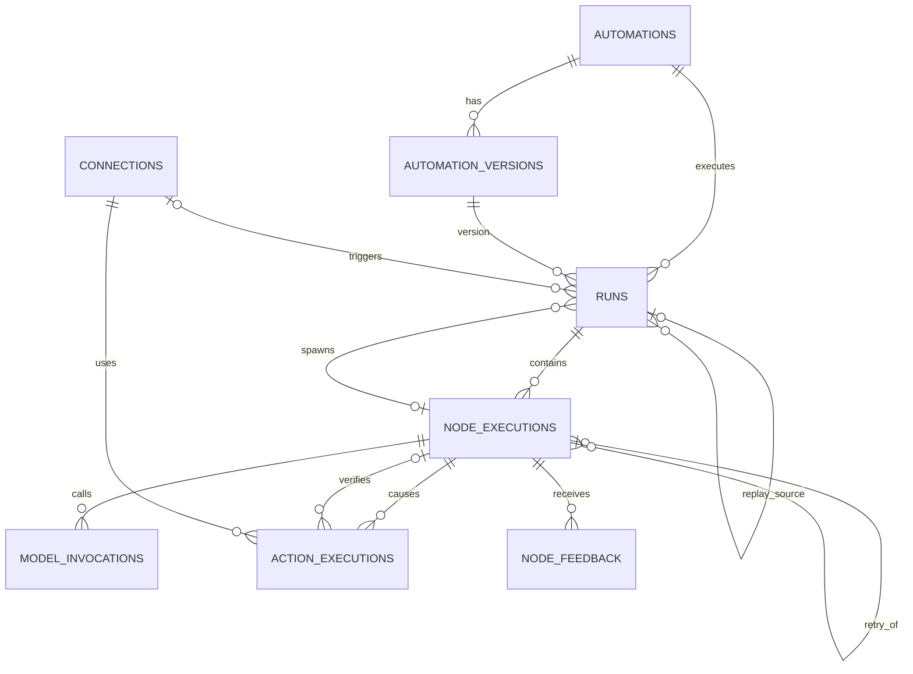

# ERD v2 Row-set Simulation Audit

This audit exercises the proposed ERD with concrete conceptual rows before any Drizzle schema is written.

Fixture source:

`docs/fixtures/database-v2-rowsets.json`

The fixture currently contains:

- 2 Automations
- 3 AutomationVersions
- 2 Connections
- 10 persisted Runs
- 29 NodeExecutions
- 5 ActionExecutions
- 1 NodeFeedback
- 1 rejected duplicate Run attempt

No database code or migration was created.

## Scenarios exercised

| Scenario | Result |
| --- | --- |
| Toss reply -> notify -> verified | PASS |
| Dependabot -> archive -> verified | PASS |
| Invoice -> notify -> unverified | PASS |
| Newsletter -> archive -> verified | PASS |
| Personal mail -> no_action | PASS |
| duplicate Gmail delivery | PASS |
| crash after external send | PASS with runtime safety invariant |
| classifier 429 + retry | ERD refinement required |
| replay with alternate model | PASS |
| incorrect classification + feedback | PASS |
| Email Triage -> child Purchase Extraction | ERD refinement required |

---

## 1. What worked without friction

### Run success and external verification are correctly independent

The invoice fixture fits naturally:

```text
Run.status                         succeeded
ActionExecution.execution_status  succeeded
ActionExecution.verification      unverified
```

No fake failure and no fake success is required.

This directly supports the UI's “run completed, one item needs attention” semantics.

### No-action paths do not create fake action rows

The personal-email fixture needs only:

- Run
- trigger NodeExecution
- classifier NodeExecution
- terminal NodeExecution

`action_executions` remains empty.

That is a good sign: the model does not require placeholder rows merely to satisfy the schema.

### Live trigger deduplication is sufficient

The duplicate Dependabot fixture attempts to insert the same:

```text
(automation_id, idempotency_key)
(a_email, gmail:c_gmail:m_github)
```

The partial unique constraint rejects the second live Run.

No second Run or downstream rows need to be persisted.

### Replay fits without mutating production systems

The replay fixture:

```text
mode             = replay
replay_of_run_id = r_toss
version          = email-v8
```

can reuse the historical input while creating **zero ActionExecution rows**.

The skipped action NodeExecution records:

```json
{ "reason": "replay_side_effect_suppressed" }
```

This is clean and explicit.

### Feedback is naturally append-only

An incorrect classifier decision is represented by:

```text
NodeExecution output = notify

NodeFeedback
  verdict         = incorrect
  expected_output = { route: archive }
```

Nothing in the historical Run is rewritten.

This is exactly what is needed for future model comparison.

---

## 2. Null audit

The simulation intentionally counted null/missing values across persisted fixture rows.

### Run

Expected sparse fields:

```text
parent/replay lineage     usually null
trigger_connection_id     null for replay/internal-child runs
idempotency_key           null for replay
error                     null for successful runs
output_snapshot           null on interrupted runs
```

These are semantically meaningful optional relationships, not null abuse.

### ActionExecution

Most optional fields are lifecycle-dependent:

- external_ref can be unknown after a crash
- response can be absent when the process dies around the I/O boundary
- verification fields are absent while verification is pending

This is also natural.

One refinement follows:

> For an external ActionExecution, `connection_id` should be NOT NULL.

If an operation does not target an external configured system, it does not need an ActionExecution row.

### NodeExecution

This exposed the major issue.

Across 29 fixture rows:

```text
model                    null on 20/29
model_provider           null on 20/29
usage_details            null on 21/29
cost_usd                 null on 22/29
model_parameters         null on 27/29
provider_request_id      null on 27/29
```

Some optionality is expected because only model-backed nodes use these fields.

But the problem is deeper than null count.

---

## 3. Material finding: introduce ModelInvocation

A model call is not the same thing as a node execution.

The current shape assumes roughly:

```text
one NodeExecution
    -> zero or one model call
```

That is already fragile for the real product.

Examples:

- provider 429 then provider retry
- cheap model then expensive-model fallback
- an agent node making several model calls
- a model node invoking a second model for verification

The user's long-term product specifically cares about optimizing model-level cost, latency, and quality.

Therefore model telemetry deserves a first-class child record.

### Revised structure

```text
Run
  └ NodeExecution
       ├ ModelInvocation 0..N
       ├ ActionExecution 0..N
       └ NodeFeedback    0..N
```

### ModelInvocation

Recommended fields:

```text
id
node_execution_id

sequence

status
  running
  succeeded
  failed

model_provider
model
model_parameters

provider_request_id

input_snapshot
output_snapshot
error

usage_details
cost_details
cost_usd
duration_ms

started_at
finished_at
```

This solves three problems at once:

1. generic NodeExecution no longer carries a large set of subtype-only nullable columns
2. multiple model calls inside one node are representable
3. model optimization queries have a clean first-class table

This mirrors the distinction seen in observability systems between a generic span/observation and model generations.

### Classifier retry fixture after this change

Instead of two classifier NodeExecutions for a provider-level 429:

```text
NodeExecution classify_email
  status = succeeded

  ModelInvocation #1
    status = failed
    provider_request_id = req-429
    error = 429

  ModelInvocation #2
    status = succeeded
    provider_request_id = req-ok
    usage_details = ...
    cost_usd = ...
```

This is materially cleaner.

If the **workflow engine itself** retries the whole node after a node failure, that is different. For that case keep:

`node_executions.retry_of_node_execution_id`

So the distinction becomes:

```text
provider/model retry
→ another ModelInvocation inside same NodeExecution

whole node retry
→ another NodeExecution linked with retry_of_node_execution_id
```

This removes an ambiguity that existed in ERD v2.

---

## 4. Material finding: child lineage should point to the spawning node

The initial audit proposed:

`runs.parent_run_id`

The row simulation showed that this loses useful information.

If Email Triage contains several nodes that can invoke child Automations, knowing only the parent Run does not tell us which graph node spawned the child.

The more precise field is:

`runs.parent_node_execution_id`

Then:

```text
Email Triage Run
  NodeExecution invoke_purchase_extraction
       │
       └── Purchase Extraction Run
           parent_node_execution_id = invoke_purchase_extraction
```

The parent Run is derivable through NodeExecution.

Therefore:

> replace `parent_run_id` with `parent_node_execution_id`.

Do not store both unless a future measured query justifies denormalization.

---

## 5. The child fixture caught a versioning violation

The first child-Automation fixture attempted:

```text
Email Triage v7
selected_edge_key = purchase
```

but v7's graph snapshot only allowed:

```text
archive
notify
spam
no_action
```

That row is invalid by design.

This is good: it proves the version invariant has real value.

Adding a `purchase` route must create another AutomationVersion before such a live Run can exist.

Required invariant:

> `selected_edge_key` must exist on the referenced Run's immutable AutomationVersion graph.

This may initially be application validation because the edge lives inside JSONB, but it must be checked before/finalizing execution.

---

## 6. Crash-after-send exposes an exactly-once limit

The fixture:

```text
Telegram request may have reached provider
worker dies before response is durably persisted
```

fits the ERD naturally as:

```text
ActionExecution.execution_status   = unknown
ActionExecution.verification       = pending
response_snapshot                  = null
external_ref                       = null
finished_at                        = null
```

This is preferable to pretending the action failed.

However, one important fact must be explicit:

> A local idempotency key cannot guarantee exactly-once external behavior when the provider itself offers no idempotency/reconciliation mechanism.

Therefore recovery policy must be:

1. claim ActionExecution before external I/O
2. use provider-native idempotency when supported
3. if outcome is unknown and cannot be reconciled, do **not** blindly resend a non-idempotent action
4. surface it as attention/unverified

The schema supports this because `execution_status = unknown` exists.

This is primarily a runtime invariant, not a reason for more tables.

---

## 7. ActionExecution timestamp refinement

The row simulation made a single `executed_at` timestamp awkward for crash/failure cases.

Prefer:

```text
started_at   NOT NULL
finished_at  NULL
verified_at  NULL
```

This mirrors Run and NodeExecution lifecycle and represents interrupted external I/O without inventing a timestamp.

Also:

`request_snapshot` should normally be present before the external call because the ActionExecution is created/claimed before I/O.

Responses and verification evidence legitimately remain nullable.

All request/response evidence must be sanitized so auth headers/tokens are never captured.

---

## 8. Connection identity invariant

Historical rows point to a mutable Connection record.

That is safe only if Connection identity is stable.

Required invariant:

> A Connection represents one stable external account/resource identity.

Refreshing OAuth credentials may update the same Connection.

Changing from Gmail account A to Gmail account B must create a new Connection rather than mutating the old one into a different identity.

This avoids needing ConnectionVersion in the MVP.

Connection `key` should also be treated as stable once referenced by an AutomationVersion.

---

## 9. UI/read-model coverage

The row sets can produce every current MVP view without adding source-of-truth aggregate columns.

### Overview

Derived from:

- Runs count
- ModelInvocation cost sum
- ActionExecution verification rate
- unresolved/failed/unknown ActionExecution count
- Connection health

### Automation Graph

Definition:

- AutomationVersion.graph_definition

Runtime node statistics:

- NodeExecution grouped by `node_key`
- ModelInvocation for model cost/latency
- ActionExecution for verification state

### Runs table

Derived from:

- Run time/input
- decision NodeExecution.selected_edge_key
- relevant ModelInvocation.model
- ActionExecution verification
- execution durations

### Run inspector

Derived from:

- Run trigger/input evidence
- decision NodeExecution
- ModelInvocation
- ActionExecution
- verifier NodeExecution

No additional persistence aggregate is required.

---

## 10. Revised candidate ERD after row simulation

The simulation changes the candidate from seven to **eight** first-class entities:

```text
Automation
AutomationVersion
Connection

Run
NodeExecution
ModelInvocation
ActionExecution
NodeFeedback
```

Relationships:



Important corrections from v2:

- `parent_run_id` -> `parent_node_execution_id`
- add `retry_of_node_execution_id`
- move all model-specific fields from NodeExecution to ModelInvocation
- ActionExecution uses `started_at / finished_at` rather than a single `executed_at`
- external ActionExecution requires `connection_id`

---

## 11. Optionality verdict

### Healthy nullable fields

These represent real lifecycle or lineage absence:

- Run.trigger_connection_id
- Run.parent_node_execution_id
- Run.replay_of_run_id
- Run.output_snapshot
- Run.error
- Run.started_at / finished_at
- NodeExecution.selected_edge_key
- NodeExecution.retry_of_node_execution_id
- NodeExecution.error
- ActionExecution.external_ref
- ActionExecution.response_snapshot
- ActionExecution.verification_evidence
- ActionExecution.verified_by_node_execution_id
- ActionExecution.finished_at / verified_at
- NodeFeedback.expected_output / note

### Null smell removed by ModelInvocation

These no longer belong on generic NodeExecution:

- model_provider
- model
- model_parameters
- provider_request_id
- usage_details
- cost_details
- cost_usd

That is the largest normalization improvement produced by the row simulation.

---

## 12. Things the row simulation did **not** justify adding

Even after exercising failure cases, these remain unnecessary:

- graph_nodes / graph_edges tables
- model registry
- prompt registry
- model pricing table
- node_attempts table
- checkpoint/event tables
- queue tables
- evaluation datasets/experiments
- ConnectionVersion
- root_run_id
- Run aggregate metric columns
- generalized artifacts/blobs
- JSONB GIN indexes

The design remains intentionally small.

---

## 13. Final audit result

The ERD can solve the intended product problem, but **ERD v2 should not be implemented exactly as written**.

The row simulation found four material refinements:

1. introduce `ModelInvocation`
2. use `parent_node_execution_id` instead of `parent_run_id`
3. add `retry_of_node_execution_id` for whole-node retry lineage
4. refine ActionExecution lifecycle around unknown external outcomes and start/finish timestamps

It also validated that:

- ActionExecution verification is worth keeping separate
- NodeFeedback is justified
- replay lineage works
- action-level idempotency is necessary
- immutable graph versions prevent impossible historical routes
- read-model metrics can remain derived

The next schema design should use this **eight-entity candidate** as the basis for the final ERD before Drizzle implementation.
